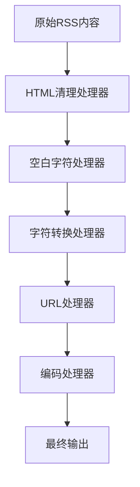

# 内容处理流程详细说明

## 1. 处理流程概述

内容处理系统采用责任链模式，将多个处理器串联成处理链，每个处理器负责特定的内容处理任务。内容按照配置的顺序依次经过各个处理器，最终输出处理后的内容。

### 1.1 处理流程图



## 2. 处理器详细说明

### 2.1 HTML清理处理器 (HtmlCleanerProcessor)

#### 功能描述
- 清理HTML标签和属性
- 处理HTML实体
- 保留必要的格式信息

#### 输入示例
```html
<div class="content">
    <script>alert('test');</script>
    <p>这是一段<strong>测试</strong>文本</p>
    <div>包含HTML标签和&quot;实体&quot;</div>
</div>
```

#### 输出示例
```html
<p>这是一段测试文本</p>
包含HTML标签和"实体"
```

#### 配置选项
```typescript
{
  htmlCleaner: {
    enabled: true,
    removeElements: ['script', 'style', 'iframe'],
    preserveElements: ['p', 'h1', 'h2', 'a']
  }
}
```

### 2.2 空白字符处理器 (WhitespaceProcessor)

#### 功能描述
- 规范化空格
- 处理换行符
- 删除多余空行
- 标准化缩进

#### 输入示例
```text
这是一段   包含多个空格的文本

这里有多个


换行符，还有    不规则的空格
```

#### 输出示例
```text
这是一段 包含多个空格的文本

这里有多个

换行符，还有 不规则的空格
```

#### 配置选项
```typescript
{
  whitespace: {
    enabled: true,
    normalizeIndentation: true,
    maxConsecutiveNewlines: 2
  }
}
```

### 2.3 字符转换处理器 (CharacterConverterProcessor)

#### 功能描述
- 全角/半角字符转换
- 统一标点符号
- 处理特殊字符
- 清理不可见字符

#### 输入示例
```text
这是一段包含全角字符的文本：ＡＢＣ１２３
包含中文标点符号：。，！？
还有特殊符号：￥＄＃
```

#### 输出示例
```text
这是一段包含全角字符的文本: ABC123
包含中文标点符号: .,!?
还有特殊符号: $#
```

#### 配置选项
```typescript
{
  characterConverter: {
    enabled: true,
    convertFullWidthToHalfWidth: true,
    normalizeQuotes: true,
    normalizePunctuation: true
  }
}
```

### 2.4 URL处理器 (UrlProcessor)

#### 功能描述
- 清理或规范化URL
- 处理链接文本
- 提取或移除链接

#### 输入示例
```text
访问我们的网站：https://example.com
或者点击这里：<a href="http://test.com">链接</a>
```

#### 输出示例
```text
访问我们的网站
或者点击这里：链接
```

#### 配置选项
```typescript
{
  urlProcessor: {
    enabled: true,
    removeUrls: true,
    preserveLinkText: true,
    urlPattern: /https?:\/\/[^\s]+/g
  }
}
```

### 2.5 编码处理器 (EncodingProcessor)

#### 功能描述
- 统一文本编码
- 修正乱码内容
- 处理特殊编码字符

#### 输入示例
```text
包含乱码的文本：�测试�
混合编码：テスト&#x6D4B;&#x8BD5;
```

#### 输出示例
```text
包含乱码的文本：测试
混合编码：テスト测试
```

#### 配置选项
```typescript
{
  encodingProcessor: {
    enabled: true,
    targetEncoding: 'UTF-8',
    handleMalformedInput: true,
    convertHtmlEntities: true
  }
}
```

## 3. 处理器链配置

### 3.1 完整配置示例
```typescript
{
  htmlCleaner: {
    enabled: true,
    removeElements: ['script', 'style', 'iframe'],
    preserveElements: ['p', 'h1', 'h2', 'a']
  },
  whitespace: {
    enabled: true,
    normalizeIndentation: true,
    maxConsecutiveNewlines: 2
  },
  characterConverter: {
    enabled: true,
    convertFullWidthToHalfWidth: true,
    normalizeQuotes: true,
    normalizePunctuation: true
  },
  urlProcessor: {
    enabled: true,
    removeUrls: true,
    preserveLinkText: true
  },
  encodingProcessor: {
    enabled: true,
    targetEncoding: 'UTF-8',
    handleMalformedInput: true
  }
}
```

## 4. 处理流程示例

### 4.1 原始内容
```html
<div class="article">
    <h1>测试文章</h1>
    <script>console.log('test');</script>
    <p>这是一段　测试文本，包含了ＡＢＣ和１２３。</p>
    <p>访问 https://example.com 了解更多。</p>
    <div>这里有一些&quot;HTML实体&quot;和   多余的空格。</div>
</div>
```

### 4.2 处理步骤

1. HTML清理处理器处理后：
```text
<h1>测试文章</h1>
<p>这是一段　测试文本，包含了ＡＢＣ和１２３。</p>
<p>访问 https://example.com 了解更多。</p>
这里有一些"HTML实体"和   多余的空格。
```

2. 空白字符处理器处理后：
```text
<h1>测试文章</h1>
<p>这是一段 测试文本，包含了ＡＢＣ和１２３。</p>
<p>访问 https://example.com 了解更多。</p>
这里有一些"HTML实体"和 多余的空格。
```

3. 字符转换处理器处理后：
```text
<h1>测试文章</h1>
<p>这是一段 测试文本,包含了ABC和123.</p>
<p>访问 https://example.com 了解更多.</p>
这里有一些"HTML实体"和 多余的空格.
```

4. URL处理器处理后：
```text
<h1>测试文章</h1>
<p>这是一段 测试文本,包含了ABC和123.</p>
<p>访问了解更多.</p>
这里有一些"HTML实体"和 多余的空格.
```

5. 编码处理器处理后：
```text
测试文章
这是一段 测试文本,包含了ABC和123.
访问了解更多.
这里有一些"HTML实体"和 多余的空格.
```

## 5. 错误处理

### 5.1 常见错误类型
- HTML解析错误
- 编码转换错误
- 字符转换错误
- 配置错误

### 5.2 错误处理策略
1. 记录错误日志
2. 保持原始内容不变
3. 继续处理链中的下一个处理器
4. 返回最佳效果的处理结果

### 5.3 错误日志示例
```json
{
  "timestamp": "2024-02-01T10:00:00Z",
  "processor": "HtmlCleanProcessor",
  "error": "Invalid HTML structure",
  "content": "<div>未闭合的标签",
  "stackTrace": "..."
}
```

## 6. 性能考虑

### 6.1 处理器优化
- 使用高效的正则表达式
- 避免重复处理
- 优化字符串操作
- 缓存处理结果

### 6.2 性能指标
- 处理时间
- 内存使用
- CPU占用
- 吞吐量

### 6.3 建议配置
```typescript
{
  // 处理大文本时的推荐配置
  htmlCleaner: {
    enabled: true,
    useCache: true,
    chunkSize: 1024 * 1024 // 1MB
  },
  whitespace: {
    enabled: true,
    optimizeRegex: true
  }
}
```

## 7. 扩展性

### 7.1 添加新处理器
1. 创建新的处理器类
2. 实现ProcessContent接口
3. 注册到处理器链
4. 配置处理顺序

### 7.2 处理器示例
```typescript
export class CustomProcessor extends BaseProcessor {
  protected processContent(content: string): string {
    // 实现自定义处理逻辑
    return processedContent;
  }
}
```

## 8. 监控和日志

### 8.1 监控指标
- 处理时间
- 错误率
- 处理量
- 资源使用

### 8.2 日志格式
```json
{
  "timestamp": "2024-02-01T10:00:00Z",
  "processor": "CharacterConverter",
  "inputLength": 1000,
  "outputLength": 950,
  "processingTime": "100ms",
  "success": true
}
```

## 9. 最佳实践

### 9.1 配置建议
- 根据需求启用必要的处理器
- 合理设置处理器顺序
- 注意性能和资源消耗
- 定期检查和更新配置

### 9.2 处理顺序建议
1. HTML清理（移除不安全内容）
2. 编码处理（确保文本编码正确）
3. 空白字符处理（规范化格式）
4. 字符转换（统一字符标准）
5. URL处理（处理链接）
6. 自定义处理（特定需求）

### 9.3 性能优化建议
- 使用流式处理大文本
- 实现处理器缓存机制
- 优化正则表达式
- 合理设置超时机制 